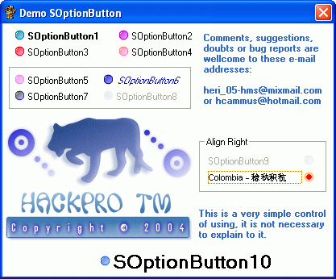



## SOptionButton 1\.0 \(Update 16\-11\-2005\)

### Description

I decided to publish this small control that has developed for one year behind for that I want to share it with all those of PSC.

It's a small simple control but attractiveness (at least for my), I wait they like it.

Support Unicode and Align.
 
### More Info
 

             |
---                |---
**Submitted On**   |2005-11-16 00:25:52
**By**             |[Heriberto Mantilla Santamaria](https://github.com/Planet-Source-Code/PSCIndex/blob/master/ByAuthor/heriberto-mantilla-santamaria.md)
**Level**          |Beginner
**User Rating**    |4.8 (121 globes from 25 users)
**Compatibility**  |VB 5\.0, VB 6\.0
**Category**       |[Custom Controls/ Forms/  Menus](https://github.com/Planet-Source-Code/PSCIndex/blob/master/ByCategory/custom-controls-forms-menus__1-4.md)
**World**          |[Visual Basic](https://github.com/Planet-Source-Code/PSCIndex/blob/master/ByWorld/visual-basic.md)
**Archive File**   |[SOptionBut19487411162005\.zip](https://github.com/Planet-Source-Code/heriberto-mantilla-santamaria-soptionbutton-1-0-update-16-11-2005__1-63117/archive/master.zip)

